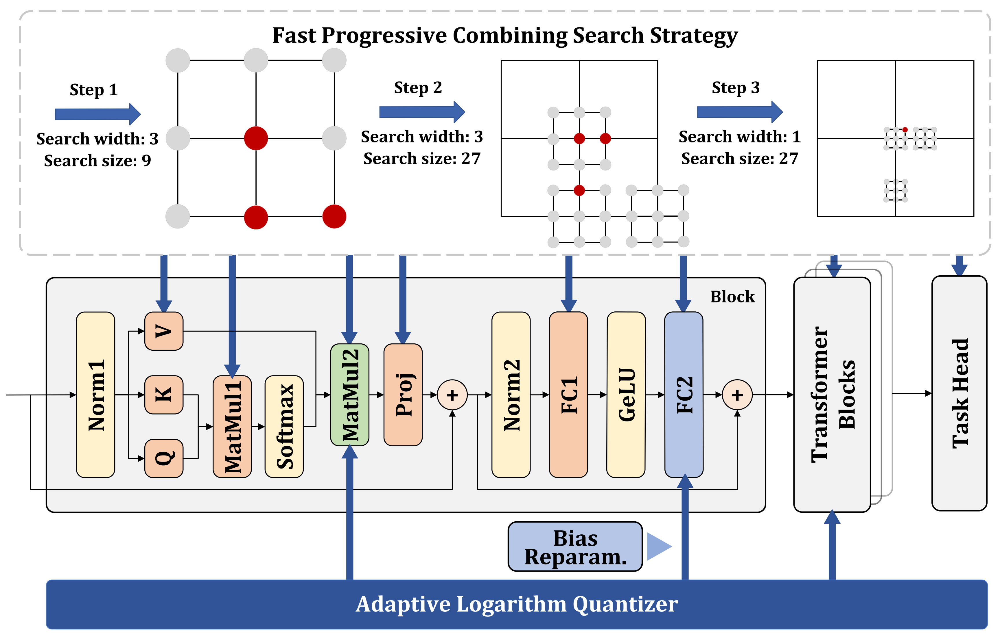

## AdaLog: Post-Training Quantization for Vision Transformers with Adaptive Logarithm Quantizer

This repository contains the official PyTorch implementation for the ECCV2024 paper "[AdaLog: Post-Training Quantization for Vision Transformers with Adaptive Logarithm Quantizer](https://arxiv.org/abs/2407.12951)". AdaLog adapts the logarithmic base to accommodate the power-law-like distribution of activations, and simultaneously allows for hardware-friendly quantization and de-quantization. By further employing the bias reparameterization, AdaLog Quantizer is applicable to both the post-Softmax and post-GeLU activations. The Fast Progressive Combining Search (FPCS) strategy is used to select the best logarithm base for AdaLog quantizers, as well as those scaling factors and zero points for uniform quantizers.



## Getting Started

- Clone this repo.

```bash
git clone https://github.com/GoatWu/AdaLog.git
cd AdaLog
```

- Install pytorch and [timm](https://github.com/huggingface/pytorch-image-models/tree/main).

```bash
pip install torch==1.10.0 torchvision --index-url https://download.pytorch.org/whl/cu113
pip install timm==0.9.2
```

All the pretrained models can be obtained using timm. You can also directly download the checkpoints we provide. For example:

```bash
wget https://github.com/GoatWu/AdaLog/releases/download/v1.0/deit_tiny_patch16_224.bin
mkdir -p ./checkpoints/vit_raw/
mv deit_tiny_patch16_224.bin ./checkpoints/vit_raw/
```

## Evaluation

You can quantize and evaluate a single model using the following command:

```bash
python test_quant.py --model <MODEL> --config <CONFIG_FILE> --dataset <DATA_DIR> [--calibrate] [--load-calibrate-checkpoint <CALIB_CKPT>] [--optimize]
```

- `--model <MODEL>`: Model architecture, which can be `deit_tiny`, `deit_small`, `deit_base`, `vit_small`, `vit_base`, `swin_small` and `swin_base`.

- `--config <CONFIG_FILE>`: Path to the model quantization configuration file.

- `--dataset <DATA_DIR>`: Path to ImageNet dataset.

- `--calibrate` and `--load-calibrate-checkpoint <CALIB_CKPT>`: A `mutually_exclusive_group` to choose between quantizing an existing model or directly load a calibrated model. The default selection is `--calibrate`.

- `--optimize`: Perform BRECQ optimization after calibration.

Example: Run calibration.

```bash
python test_quant.py --model deit_tiny --config ./configs/3bit.py --dataset ~/data/ILSVRC/Data/CLS-LOC --val-batch-size 500 --calibrate
```

Example: Run calibration and optimization.

```bash
python test_quant.py --model deit_tiny --config ./configs/3bit.py --dataset ~/data/ILSVRC/Data/CLS-LOC --val-batch-size 500 --calibrate --optimize
```

Example: Load a calibrated checkpoint, and then run optimization.

```bash
python test_quant.py --model deit_tiny --config ./configs/3bit.py --dataset ~/data/ILSVRC/Data/CLS-LOC --val-batch-size 500 --load-calibrate-checkpoint ./checkpoints/quant_result/deit_tiny_w3_a3_s3_calibsize_32.pth --optimize
```

Example: Test an optimized checkpoint.

```bash
python test_quant.py --model deit_tiny --config ./configs/3bit.py --dataset ~/data/ILSVRC/Data/CLS-LOC --val-batch-size 500 --load-optimize-checkpoint ./checkpoints/quant_result/deit_tiny_w3_a3_s3_optimsize_1024.pth --test-optimize-checkpoint
```

## Results

The fake-quantized checkpoint in FP32 can be obtained in [Google Drive](https://drive.google.com/drive/folders/1LGOOBRljCgtQdLsM5BEy_zFskKhR0vz5?usp=sharing).

| Quant &nbsp;Model&nbsp;  |   Full Prec.    | W3A3 (Calibrate) | W3A3 (Retrain) | W4A4 (Calibrate) | W4A4 (Retrain) | W6A6 (Calibrate) |
| :----: | :-------: | :--------------: | :-------------: | :--------------: | :-------------: | :--------------: |
| ViT-S  |   81.39   |      13.88       |      62.50      |      72.75       |      77.25      |      80.91       |
| ViT-B  |   84.54   |      37.91       |      76.73      |      79.68       |      83.13      |      84.80       |
| DeiT-T |   72.21   |      31.56       |      48.78      |      63.52       |      67.14      |      71.38       |
| DeiT-S |   79.85   |      24.47       |      63.24      |      72.06       |      76.36      |      79.39       |
| DeiT-B |   81.80   |      57.45       |      74.99      |      78.03       |      80.20      |      81.55       |
| Swin-S |   83.23   |      64.41       |      76.01      |      80.77       |      81.99      |      83.19       |
| Swin-B |   85.27   |      69.75       |      78.82      |      82.47       |      83.82      |      85.09       |

## Citation
 
If you find our work useful in your research, please consider citing:
```
@inproceedings{wu2024adalog,
title={AdaLog: Post-Training Quantization for Vision Transformers with Adaptive Logarithm Quantizer},
author={Wu, Zhuguanyu and Chen, Jiaxin and Zhong, Hanwen and Huang, Di and Wang, Yunhong},
booktitle={European Conference on Computer Vision (ECCV)},
year={2024}
}
```
